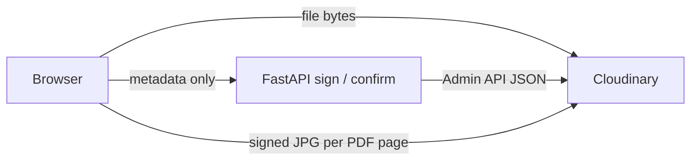

# Kolom — Attachment upload flow, security & gaps

**Last updated:** 2026-08-13

---

## How upload works

1. User picks a file in the browser. Frontend checks extension + MIME (infers MIME from extension when Windows sends an empty `file.type`). Maximum size: **10 MB**.
2. **`POST /attachments/sign`** — metadata only (name, type, size). **No file bytes** are sent to FastAPI.
3. Backend sanitizes the filename, matches extension ↔ MIME, chooses Cloudinary resource type (`image` or `raw`), and creates a **pending** DB row plus signed upload parameters.
4. Browser uploads **directly to Cloudinary** (`/image/upload` or `/raw/upload`).
5. **`POST /attachments/{id}/confirm`** — backend calls the Cloudinary Admin API (JSON only), verifies format and resource type, stores metadata (including `page_count` for PDFs), and marks the attachment **ready** or **failed**.
6. List/detail API returns derived URLs appropriate to each file type.

---

## All upload surfaces (single pipeline)

Every attachable entity uses the **same** validation and upload flow. `entity_type` (PO, invoice, `support_ticket`, etc.) only affects **linking** and Cloudinary **folder naming** — not security checks.

| Surface | Entry point |
|---------|-------------|
| Order collaboration | `AttachmentPanel` on order detail panels |
| Uploads playground | `AttachmentPanel` on [`UploadsPage`](../../frontend/src/pages/newpages/UploadsPage.tsx) |
| Manage attachments dialog | [`AttachmentsManageDialog`](../../frontend/src/components/newcomponents/customui/AttachmentsManageDialog.tsx) |
| Desktop direct upload | [`POST /attachments/sign`](../../app/api/v1/endpoints/attachments.py) + confirm |
| Mobile QR portal | [`MobileUploadQrDialog`](../../frontend/src/components/newcomponents/customui/MobileUploadQrDialog.tsx) on `AttachmentPanel` → public `/m/<token>` (see **Limits & mobile upload**) |
| Help tickets | `AttachmentPanel` on [`HelpPage`](../../frontend/src/pages/newpages/HelpPage.tsx) (`entityType="support_ticket"`) |

**Adding a new attachable entity:** extend `AttachmentEntityTypeEnum` + folder/label wiring in [`attachment_manager.py`](../../app/managers/attachment_manager.py). Reuse `AttachmentPanel` — **no** separate validator or upload UI.

### Canonical allowlist sources (keep in sync)

| Role | File |
|------|------|
| **Backend enforcement** (authoritative) | [`app/utils/attachment_allowlist.py`](../app/utils/attachment_allowlist.py) |
| **Frontend pre-check** (UX mirror) | [`frontend/src/lib/attachmentAllowlist.ts`](../../frontend/src/lib/attachmentAllowlist.ts) |

When changing allowed types, size limits, or **per-entity cap**:

1. Update **both** allowlist files + `MAX_ATTACHMENTS_PER_ENTITY` (backend [`config.py`](../app/core/config.py), frontend [`attachmentAllowlist.ts`](../../frontend/src/lib/attachmentAllowlist.ts)).
2. Update frozen spec in [`tests/test_attachment_allowlist_sync.py`](../tests/test_attachment_allowlist_sync.py).
3. Run [`tests/test_attachments.py`](../tests/test_attachments.py), sync test, [`test_attachment_entity_limit.py`](../tests/test_attachment_entity_limit.py), [`test_mobile_upload.py`](../tests/test_mobile_upload.py).

### Limits & mobile upload

**Per-entity cap (25):** Max 25 non-deleted links per `(workspace_id, entity_type, entity_id)` — PO #101 and PO #102 each get their own bucket. Counts `pending` + `ready` + `failed`; delete frees a slot. Enforced at desktop `POST /attachments/sign` and mobile `POST /mobile-upload/sessions/{id}/promote` (`AttachmentLimitError` → 400). Phone **staging does not** consume a slot until promote. `GET /attachments` → `{ items, slot_count, max_per_entity }`; UI disables add at cap.

**Mobile QR portal:** Same person at desk; phone has no Kolom login — short-lived token in QR URL (~10 min, one file).

| Step | Auth | What happens |
|------|------|----------------|
| 1 | JWT | `POST /mobile-upload/sessions` → raw token once; bound to workspace, creator, target entity |
| 2 | Token | Phone `/m/<token>` → `GET /mobile-upload/public` (404 if bad/expired — **never 401**) |
| 3 | Token | CamScan on device → `public/sign` (allowlist + 10 MB) → **one** Cloudinary upload to **staging** |
| 4 | Token | `public/confirm` → Admin API verify → session `uploaded` |
| 5 | JWT | Desktop polls → name/note → **promote** → Cloudinary **rename** staging into attachment folder, cap check, Admin confirm → session `consumed` |

Security: token stored as **sha256** only; same allowlist at public sign/confirm; public endpoints rate-limited; JWT create 10/min; staging destroyed on cancel or unused sign overwrite; promote **moves** asset (no destroy). Nothing attaches until logged-in promote. UI: `MobileUploadQrDialog` on `AttachmentPanel` (QR hidden below `md`). **v1 gap:** staging orphan if desk tab closes after phone upload but before promote/cancel (no sweeper cron).

---

## Allowed types

| Category | Extensions | Cloudinary | In-app behavior |
|----------|------------|------------|-----------------|
| Images + PDF | jpg, jpeg, png, webp, heic, heif, pdf | `image` | Images: thumbs/previews. PDFs: **viewed only via Cloudinary** (see below) |
| Office / text | docx, xlsx, txt, csv | `raw` | Download-only (icon + filename) |
| **Blocked** | .doc, .xls, macros, svg, html, js, exe, zip, mismatch | — | Rejected at sign |

---

## Preview behavior

- **Images** — Thumbnail + enlarge in dialog (signed Cloudinary delivery URLs).
- **PDF** — **In-app viewing is Cloudinary-only.** The browser never renders the raw PDF file for preview. Kolom requests signed Cloudinary URLs that rasterize each page server-side (`page=N` → JPG). The expand dialog shows those JPGs with **Prev/Next** and **Download** in the header; the manager layout uses the same page viewer. Full PDF download uses a separate signed `fl_attachment` URL.
- **Office / text** — No in-app preview; user downloads to open locally.

---

## Security in place

- Allowlist at **sign** and **confirm** (catches “signed as txt, uploaded as exe”).
- Workspace-scoped API; authenticated Cloudinary delivery URLs.
- Backend **never** stores or executes upload bytes on Railway.
- PDF in-app viewing = **Cloudinary rasterized JPG pages only** — Kolom never embeds the PDF blob, native PDF viewer, or PDF.js in the tab. Each page is a signed Cloudinary image URL from `GET /attachments/{id}/pdf-page?page=N`.
- Office/text never embedded (no iframe, no `innerHTML` for txt).

---

## Risks & gaps (accepted for now)

| Risk | Notes |
|------|--------|
| **Local malware** | Real docx/xlsx/pdf can still harm the user if opened in Office/Adobe on their PC. **No virus scan.** |
| **Signed URLs** | `download_url` and PDF page URLs are capability links; leak = fetch without Kolom login. No short expiry / one-time tokens yet. |
| **`file_url` in API JSON** | UI ignores for raw files; minor DevTools side door vs `download_url`. |
| **Trust model** | Assumes trusted workspace members. **Exception:** mobile QR token (~10 min capability link; attach still needs desktop promote). |
| **Legacy `.doc` blocked** | Uncommon; users re-save as docx. |
| **Older PDFs** | May lack `page_count` until re-upload; Next still works until last page fails. |
| **Out of scope** | No DLP, URL-sharing audit, or ClamAV unless scan infra is added later. |

---

## Architecture

- **Browser → FastAPI:** metadata only (sign / confirm / promote / mobile session).
- **Browser → Cloudinary:** file bytes on upload (desktop or phone staging); PDF preview = signed JPG pages only.
- **FastAPI → Cloudinary:** Admin API JSON only (verify, rename, destroy). FastAPI never downloads or holds file bytes.
